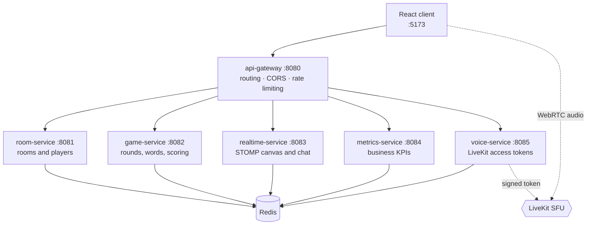

# UniPlay

**A real-time collaborative drawing-and-guessing game for university communities,
built as six independently deployable microservices.**

[](https://github.com/juanmavill/Uniplay/actions/workflows/ci.yml)

Players join a room with a code, take turns drawing on a shared canvas, and guess
words from subject-specific decks. Drawing strokes, chat, scores and voice all
propagate live to every participant.

| | |
|---|---|
| **Services** | 6 Spring Boot microservices + React client |
| **Tests** | 171 automated tests, all green in CI |
| **Real time** | WebSocket/STOMP for canvas and chat, Redis Pub/Sub between services |
| **Voice** | WebRTC through LiveKit, with mute and speaking indicators |
| **Observability** | Prometheus metrics, provisioned Grafana dashboard, alert rules |
| **Load tested** | k6 profiles up to 500 concurrent users |
| **Cloud** | CloudFormation stack deployed on AWS across two availability zones |

---

## Architecture



Services never share memory, a database, or domain code. They talk over HTTP
through the gateway, and publish domain events to Redis Pub/Sub. Each one builds,
tests, packages and deploys on its own.

Inside every service the layout is the same hexagonal shape:

```text
domain/model          entities and value objects, no framework imports
application/port/in   use cases the outside world can invoke
application/port/out  interfaces the domain needs from the outside
application/service   use case implementations
infrastructure/       REST controllers, Redis adapters, configuration
```

The dependency arrow always points inward: `infrastructure` knows about
`application`, never the reverse. That is what makes the domain testable without
Spring, Redis or a network.

---

## Technical decisions

**Why six services rather than a modular monolith.** For a game of this size a
modular monolith would have been the simpler and, on pure engineering grounds,
probably the better choice. Microservices were chosen to practise independent
deployment, per-service observability and inter-service messaging. Two of the
boundaries hold up well on their own merits and two are harder to defend. The
full analysis, including which ones I would merge today, is in
[ADR 0003](docs/adr/0003-limites-de-servicio.md).

**Why a monorepo.** One person, thirteen user stories, and integration tests that
span services. Separate repositories would have added coordination cost with no
benefit at this scale. The monorepo does not make it a monolith: every service
has its own `pom.xml`, `Dockerfile` and CI job. See
[ADR 0001](docs/adr/0001-monorepo-con-despliegue-independiente.md).

**Why Redis Pub/Sub instead of a message broker.** Domain events here are
notifications for live gameplay: if a subscriber is down, replaying a stroke that
happened thirty seconds ago is worthless. Redis was already needed for room state
and TTLs, so Pub/Sub avoided a second piece of infrastructure. A broker with
durable queues would be the right call the moment an event needs to survive a
restart.

**Why STOMP over raw WebSocket.** Canvas strokes, chat and round events share one
connection but need separate destinations. STOMP provides that multiplexing plus
SockJS fallback, instead of hand-rolling a message envelope and a router.

**Why services are grouped onto shared EC2 nodes in AWS.** One instance per
service multiplies cost without a matching benefit, and realtime-service cannot
run as multiple replicas without distributed STOMP session coordination.
[ADR 0002](docs/adr/0002-aws-recuperacion-automatica.md) documents the grouping,
the auto-recovery setup and what is lost when an instance is replaced.

---

## Running it locally

Requires Docker and Docker Compose.

```bash
cp infra/.env.example infra/.env
docker compose -f infra/docker-compose.yml up -d --build
```

Open http://localhost:5173. Create a room, then open the player link in a second
tab to join as another player.

| Endpoint | URL |
|---|---|
| Client | http://localhost:5173 |
| API gateway | http://localhost:8080 |
| Prometheus | http://localhost:9090 |
| Grafana | http://localhost:3000 |

Public API through the gateway:

| Operation | Request |
|---|---|
| Create room | `POST /salas` |
| Join room | `POST /salas/{code}/jugadores` |
| Start round | `POST /games/{code}/rounds` |
| Submit answer | `POST /games/{code}/answers` |
| Voice token | `POST /voice/token` |
| Business KPIs | `GET /metrics/kpis` |
| WebSocket | `GET /ws` (SockJS + STOMP) |

---

## Tests

```bash
cd room-service && mvn verify     # any service
cd frontend && npm test           # client
```

171 tests run on every push:

| Module | Tests | Focus |
|---|---:|---|
| game-service | 52 | Round lifecycle, scoring, decks, voting |
| room-service | 44 | Room invariants, join rules, Redis persistence |
| frontend | 24 | Deck parsing, player routes, event handling |
| realtime-service | 19 | Canvas delta validation, STOMP broadcast |
| voice-service | 16 | Token issuing, mute state |
| metrics-service | 9 | KPI projection against a real Redis |
| api-gateway | 7 | Routing, CORS, rate limiting |

Domain and use-case tests run without Spring. `metrics-service` uses
Testcontainers to start a real Redis, because its entire job is consuming Pub/Sub
and a mocked connection would not exercise the channel subscriptions.

Backend modules enforce a 70% line coverage gate through JaCoCo.

---

## Observability and load

Every service exposes Prometheus metrics through Actuator and writes structured
JSON logs. Prometheus scrapes them, Grafana is provisioned from version-controlled
dashboards, and alert rules cover service availability and latency.

```bash
k6 run tests/load/uniplay.js
```

Load profiles ramp to 500 concurrent users. Details in
[`docs/observability.md`](docs/observability.md).

---

## AWS deployment

`infra/aws/` holds the CloudFormation templates for a two-availability-zone
deployment: VPC and networking, ElastiCache Redis with a Multi-AZ replica, and
Auto Scaling Groups that replace a failed instance automatically. Services are
grouped onto edge, core, media and observability nodes. Container images are
published to ECR, secrets come from AWS Secrets Manager, and instance metadata
uses IMDSv2.

```bash
./infra/aws/deploy-resilient.sh
./infra/aws/destroy-resilient.sh
```

See [`docs/aws-deployment.md`](docs/aws-deployment.md).

---

## Known limitations

- **Business KPIs live in memory.** `metrics-service` keeps its projection in
  local sets, so counters reset when the service restarts and would diverge
  across replicas. Persisting the projection is the obvious next step.
- **realtime-service cannot scale horizontally.** STOMP sessions are held in
  process. Running more than one instance requires an external session store or a
  broker relay, which is why AWS runs it as a single-instance Auto Scaling Group.
- **In-flight state is lost when an instance is replaced.** Room and round state
  survives in Redis; unconfirmed strokes and open WebSocket sessions do not.
- **The App component is still large.** Domain logic, the HTTP client and
  presentational components were extracted into modules, but `App` still holds the
  full match state. Splitting it further means moving the STOMP and voice effects
  into their own hooks.
- **No end-to-end browser tests.** Coverage is unit and integration level; the
  full multiplayer flow has only been verified manually.
- **AWS deployment used an academic account.** CloudFront and some IAM actions
  were unavailable, so HTTPS is served by Caddy with `nip.io` hostnames. That is
  fine for a demo and not appropriate for production.
