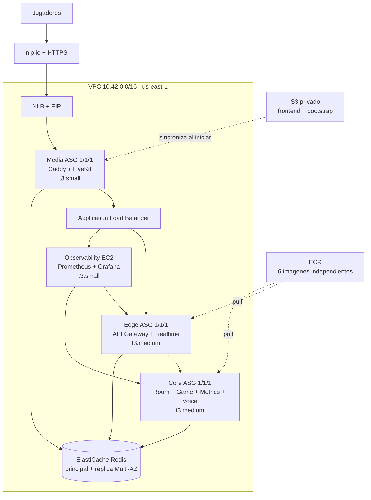

# Despliegue AWS de UniPlay

## Arquitectura desplegada



Edge y Core pueden ubicarse en cualquiera de las dos subredes privadas. Cada
ASG mantiene una sola instancia: ofrece recuperacion automatica, no dos
replicas activas. Redis es el componente con replica simultanea Multi-AZ.

## Endpoints actuales

| Componente | URL |
|---|---|
| UniPlay | `https://uniplay.3.82.79.9.nip.io` |
| Grafana | `https://uniplay.3.82.79.9.nip.io/grafana/` |
| LiveKit | `wss://livekit.3.82.79.9.nip.io` |

Las credenciales de Grafana se generan en cada despliegue y se guardan fuera
de Git. El usuario es `admin`.

## Evidencia de validacion

- Stacks `uniplay-foundation` y `uniplay-application` operativas; ambas
  quedaron en `UPDATE_COMPLETE` despues de los ajustes validados.
- Siete target groups saludables: Caddy HTTP/HTTPS, API Gateway, Grafana y
  LiveKit signaling/TCP/UDP.
- Prometheus: 7 de 7 targets en estado `up`.
- Flujo probado: crear sala, unir jugadores, iniciar ronda y ocultar la palabra
  al jugador que adivina.
- Voz probada desde navegador: token emitido, conexion LiveKit establecida y
  participante visible como `Escuchando`.

## Operacion

Desplegar desde AWS CloudShell:

```bash
AWS_REGION=us-east-1 ./infra/aws/deploy-resilient.sh
```

Destruir todos los recursos administrados por las dos pilas:

```bash
AWS_REGION=us-east-1 ./infra/aws/destroy-resilient.sh
```

La topologia usa dos NAT Gateway para mantener salida en ambas zonas. Son uno
de los componentes de mayor costo y deben eliminarse con el script cuando la
demostracion termine.

## Limitacion del laboratorio

El rol de AWS Academy bloquea `cloudfront:CreateDistribution`. Por eso el
despliegue predeterminado usa Caddy y certificados Let's Encrypt sobre la EIP.
El template conserva CloudFront detras de `EnableCloudFront=true` para una
cuenta con permisos completos.
