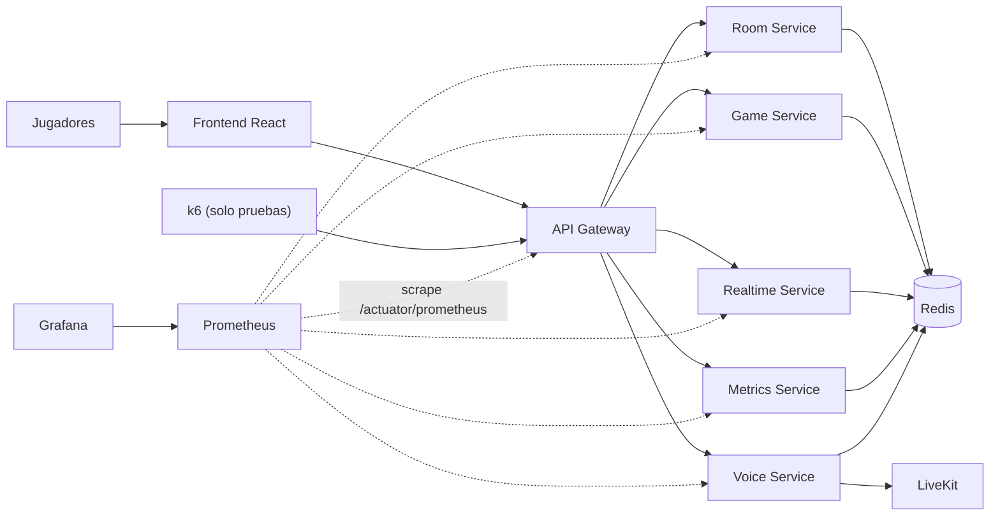

# Observabilidad y pruebas de carga

## Arquitectura local



Prometheus consulta los seis procesos Spring Boot cada 15 segundos. Grafana
usa Prometheus como datasource y carga automaticamente el dashboard
`UniPlay - Overview`.

## Inicio

Desde la raiz del monorepo:

```powershell
docker compose -f infra/docker-compose.yml up -d --build
```

Servicios de observabilidad:

| Herramienta | URL | Acceso local predeterminado |
|---|---|---|
| Prometheus | `http://localhost:9090` | Sin autenticacion |
| Grafana | `http://localhost:3000` | `admin` / `uniplay` |

Las credenciales predeterminadas son solo para desarrollo local. Se pueden
cambiar con `GRAFANA_ADMIN_USER` y `GRAFANA_ADMIN_PASSWORD`.

## Dashboard

El dashboard aprovisionado muestra:

- servicios disponibles;
- solicitudes por segundo por aplicacion;
- latencia HTTP p95;
- porcentaje de respuestas 5xx;
- memoria heap de cada JVM;
- CPU de cada proceso.

## Alertas

Prometheus evalua estas reglas:

| Alerta | Condicion |
|---|---|
| `UniPlayServiceDown` | Un servicio no responde durante 1 minuto |
| `UniPlayHighHttpErrorRate` | Mas de 1% de respuestas 5xx durante 5 minutos |
| `UniPlayHighHttpLatency` | Latencia p95 mayor a 500 ms durante 5 minutos |
| `UniPlayHighJvmHeapUsage` | Heap JVM mayor a 85% durante 10 minutos |

Las reglas se pueden consultar en `http://localhost:9090/alerts`.

## Pruebas k6

El escenario crea una sala por usuario virtual, une al jugador y consulta
periodicamente la lista de participantes. Cada VU usa una IP sintetica en
`X-Forwarded-For` para medir el backend sin agrupar toda la carga de Docker en
un unico contador del rate limit local.

| Perfil | Usuarios virtuales | Duracion aproximada |
|---|---:|---:|
| `smoke` | 3 | 20 segundos |
| `load` | 100 | 2 minutos |
| `stress` | 500 | 5 minutos |

Ejecutar el perfil rapido:

```powershell
docker compose -f infra/docker-compose.yml --profile load-test run --rm -e K6_PROFILE=smoke k6
```

Ejecutar carga normal:

```powershell
docker compose -f infra/docker-compose.yml --profile load-test run --rm -e K6_PROFILE=load k6
```

Ejecutar el estres de 500 usuarios concurrentes:

```powershell
docker compose -f infra/docker-compose.yml --profile load-test run --rm -e K6_PROFILE=stress k6
```

El perfil de 500 usuarios debe ejecutarse de manera intencional mientras se
vigila Grafana, porque puede agotar CPU o memoria de un equipo de desarrollo.
Los criterios de aprobacion son menos de 1% de errores, mas de 99% de checks y
latencia HTTP p95 inferior a 500 ms.
